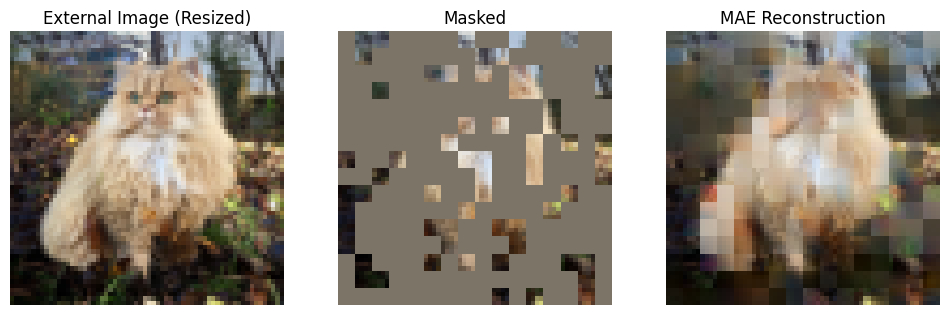

# Masked Autoencoders reproduction for Tiny ImageNet (Master 2 project)

This repository implements Masked Autoencoders (MAE) for small-scale vision learning, specifically targeting Tiny ImageNet with ViT-Lite architectures. It follows the methodology of "Masked Autoencoders Are Small Scale Vision Learners (He et al., 2021) " to validate MAE's effectiveness under constrained resources.

<p align="center">
  
</p>

## Quick Start

### Prerequisites
- Python 3.13+
- [uv](https://github.com/astral-sh/uv) (Package manager)
- [just](https://github.com/casey/just) (Command runner)

### Setup
```bash
# Sync dependencies
uv sync

# Setup environment
cp .env.example .env

# Install pre-commit hooks
uv run pre-commit install
```

## Reproduction Commands

To reproduce the exact results, follow these steps in order. Note that classification runs require a path to a pre-trained checkpoint.

### 1. Pre-training
Run the following command to start the 800+ epoch pre-training on Tiny ImageNet.
```bash
uv run python src/m2_ovo_mae/train_pretrain.py system=cluster_slurm
```

### 2. Linear Probing
Train a linear classifier on frozen features from a pre-trained encoder.
```bash
uv run python src/m2_ovo_mae/train_classifier.py \
    experiment=linprobe_tin \
    pretrained_checkpoint=outputs/2026-02-06/19-41-41/checkpoint-1199.pth
```

### 3. Fine-tuning
End-to-end fine-tuning of the pre-trained encoder and classification head.
```bash
uv run python src/m2_ovo_mae/train_classifier.py \
    experiment=finetune_tin \
    pretrained_checkpoint=outputs/2026-02-06/19-41-41/checkpoint-1199.pth
```

## Methodology

- **Dataset:** Tiny ImageNet (100k images, 200 classes, 64x64 resolution).
- **Architecture:** ViT-Lite (Encoder: 7 layers, 256 dim; Decoder: 2 layers, 128 dim).
- **Protocol:** 75% random masking, MSE loss on masked patches with per-patch normalization.

## Hyperparameters

The following table summarizes the hyperparameters used for the different training phases.

| Hyperparameter | Pre-training | Linear Probing | Fine-tuning |
| :--- | :--- | :--- | :--- |
| Optimizer | AdamW | AdamW | AdamW |
| Betas | (0.9, 0.95) | (0.9, 0.95) | (0.9, 0.999) |
| Base Learning Rate | 5e-4 | 1e-3 | 1e-3 |
| Weight Decay | 0.15 | 0.0 | 0.05 |
| Batch Size | 256 | 128 | 128 |
| Epochs | 800 / 1200 | 50 | 100 |
| Warmup Epochs | 20 / 40 | 2 | 5 |
| Learning Rate Schedule| Cosine Decay | Cosine Decay | Cosine Decay |
| Augmentation | Flip + RRC | Flip | RandAug (2, 9) |
| Masking Ratio | 75% | - | - |
| Pixel Normalization | Yes | - | - |

## Structure

- `src/m2_ovo_mae/`: Core package (models, dataset, training scripts).
- `configs/`: Hydra configuration files.
- `notebooks/`: Visualization and inference analysis.
- `tests/`: Unit and integration tests.
- `outputs/`: Local checkpoints and training logs.
